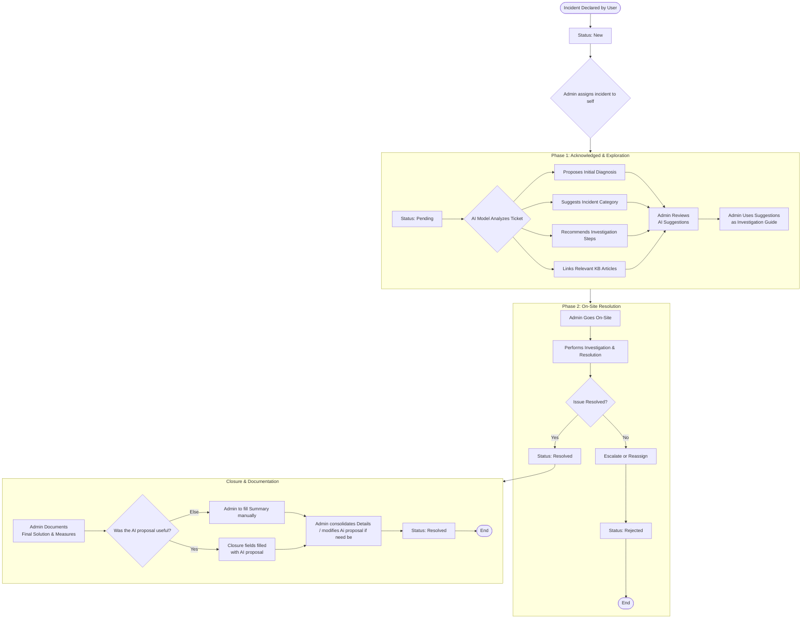

```mermaid
flowchart TD
    A([Incident Declared by User]) --> B[Status: New]
    B --> C{Admin assigns incident to self}

    C --> D
    subgraph D [Phase 1: Acknowledged & Exploration]
        D1[Status: Pending]
        D1 --> D2{AI Model Analyzes Ticket}
        D2 --> D3[Proposes Initial Diagnosis]
        D2 --> D4[Suggests Incident Category]
        D2 --> D5[Recommends Investigation Steps]
        D2 --> D6[Links Relevant KB Articles]
        D3 & D4 & D5 & D6 --> D7[Admin Reviews<br>AI Suggestions]
        D7 --> D8[Admin Uses Suggestions<br>as Investigation Guide]
    end

    D --> E
    subgraph E [Phase 2: On-Site Resolution]
        E1[Admin Goes On-Site]
        E1 --> E2[Performs Investigation & Resolution]
        E2 --> E3{Issue Resolved?}
        E3 -- Yes --> E4[Status: Resolved]
        E3 -- No --> E5[Escalate or Reassign]
        E5 --> E7[Status: Rejected] --> E6([End])
    end

    E4 --> F
    subgraph F [Closure & Documentation]
        F1[Admin Documents<br>Final Solution & Measures]
        F1 --> F2{Was the AI proposal useful?}
        F2 --Yes--> F3[Closure fields filled <br> with AI proposal]
        F2 --Else--> F7[Admin to fill Summary manually]
        F7 & F3 --> F4[Admin consolidates Details / modifies Ai proposal if need be]
        F4 --> F5[Status: Resolved]
        F5 --> F6([End])
    end
```